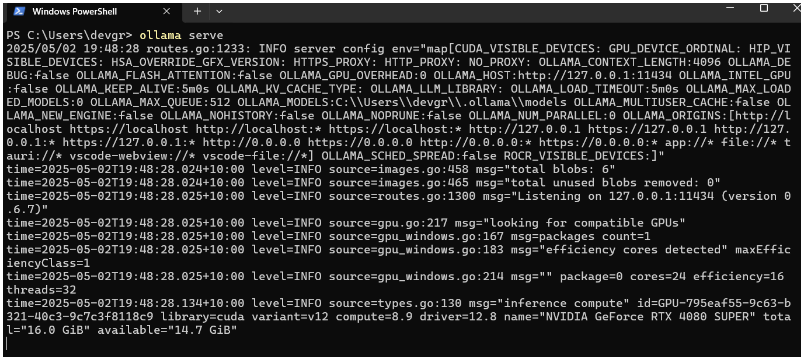
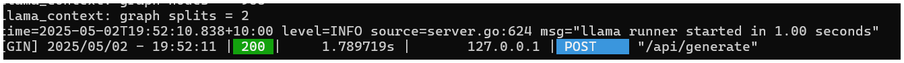
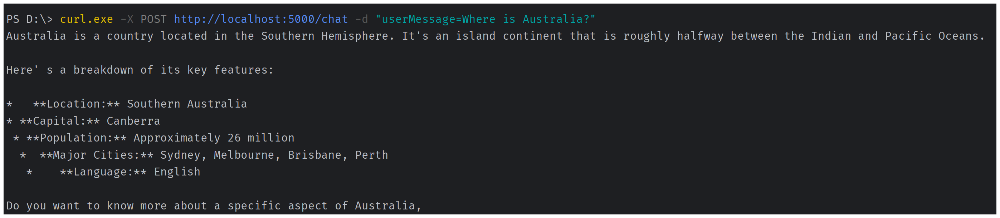
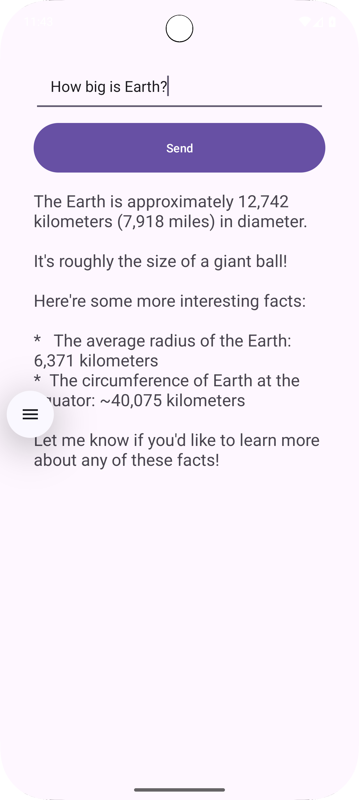
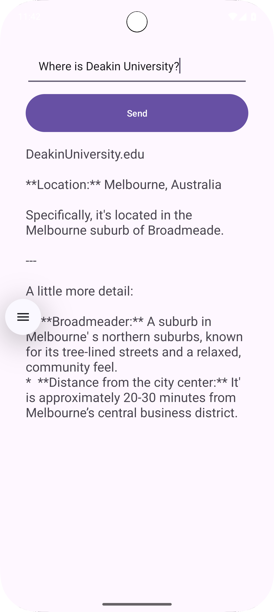

# Backend Code For Task 8.1C 
For frontend sample android app: https://github.com/dgdeakin/Task8.1CAndroidAppExample

# Files
Three files are present, use the file that works for you (Feel free to edit).
1. main-directModel.py
2. main-pipeline.py
3. main-ollama.py (Need to download ollama, may skip steps 4, 5)

You can explore code from previous year from here:
https://github.com/sit3057082025/T-8.1C. 
Readme file is useful.

# Instructions:
- Almost similar to previous setups as in Task6.1D Backend code setup (For files 1 and 2).
- Detailed steps are in ReadME of this repo:
https://github.com/sit3057082025/BackendApiLLM_T6.1D
- For File 3, you need to install ollama.

## 1. First clone the repo or download to your local folder.
## 2. Run terminal in the project folder.
   - Make sure python is installed. https://www.python.org/downloads/
   - Create Virtual environment using this in terminal: ```python -m venv venv```
   - venv folder will be created.
   - now activate virtual environment
     - For MAC:
        ```source venv/bin/activate```
     - For Windows PS:
       ```.\venv\Scripts\Activate.ps1```
## 3. Now install the libraries
   - ```pip install Flask```
     (source: https://flask.palletsprojects.com/en/stable/installation/)
   - ```pip install accelerate```
   - ```pip install requests```
   - ```pip install transformers```
     (source: https://pypi.org/project/transformers/)
   - ```pip3 install torch torchvision torchaudio --index-url https://download.pytorch.org/whl/cu126```
     (source: https://pytorch.org/get-started/locally/)
## 4. Settings with HuggingFace (Skip this if using main-ollama.py and go to Step 6 below)
   - Signup for Huggingface Account here: https://huggingface.co/
   - Create access token from here: https://huggingface.co/settings/tokens
   - Get Model "google/gemma-3-1b-it" from https://huggingface.co/google/gemma-3-1b-it.
      Acknowledge licence.

   

   - Then run this in terminal:
     ```huggingface-cli login```

   - It will ask for hugging face token, provide and press enter. Then select Y.
     
## 5. To run the code in terminal (Skip this if using main-ollama.py and go to stop 6 below): 
```python main-directModel.py```

or 

```python main-pipeline.py```


# 6. Using python main-ollama.py
a) First download and install ollama from: https://ollama.com/download

b) In your new terminal, run:
   - ```ollama serve```
   - You should get:
   
   
   
NOTE: You might need to pull model as: ```ollama pull llama3.2:latest```

c) Then, in your backend (this project) terminal (in new from above 6.b terminal), run
   ```python main-ollama.py```
   
d) Then, either test the route points in postman as below (Steps 7a, 7b).

e) Or run the android app.

f) On successful run you should get:

  - in Ollama serve terminal


   


   - in your backend terminal,


   
   - in you android app,


# 7. To retrieve check response:
## a) Using curl in terminal PS (as shown in image below):
- PS D:\> curl.exe -X POST http://localhost:5000/chat -d "userMessage=Where is Australia?"
  


## b) using PostMan (as shown in image below)
METHOD: POST

URL: http://localhost:5000/chat

Body: x-www-form-urlencoded
- key: userMessage
- Value: Where is Australia?


# c) In Sample Android app:
- Use JsonRequest or other tools:





# 8. Troubleshooting
1. port 5000 may not be available sometimes, use different post like 5001. Change in android app as well the port number.
2. Make sure to run  "huggingface-cli login" command in terminal and provide token.
3. Make sure to acknowledge licence in the model site such as https://huggingface.co/google/gemma-3-1b-it
4. Select most permissions while creating access token.
5. Try with different models based on quick access. https://huggingface.co/models
6. Use small models.

# 9. Good to know about:
1. Python https://www.python.org/
2. Virtual Environments https://docs.python.org/3/library/venv.html
3. Flask https://flask.palletsprojects.com/en/stable/
4. Huggingface Transformers https://huggingface.co/docs/transformers/en/index

Further references (From Previous)
[https://github.com/sit3057082025/T-8.1C](https://github.com/sit3057082025/T-8.1C)


# References:
1. Transformers: State-of-the-art Machine Learning for Pytorch, TensorFlow, and JAX.
https://github.com/huggingface/transformers
2. A simple way to launch, train, and use PyTorch models on almost any device and distributed configuration, automatic mixed precision (including fp8), and easy-to-configure FSDP and DeepSpeed support
https://github.com/huggingface/accelerate
3. Ollama
https://ollama.com/
4. How to Build a Flask Python Web Application from Scratch
https://www.digitalocean.com/community/tutorials/how-to-make-a-web-application-using-flask-in-python-3
5. https://flask.palletsprojects.com/en/stable/
6. What is Postman?
https://www.postman.com/product/what-is-postman/
https://learning.postman.com/docs/getting-started/overview/
7. What is curl command? 
https://developer.ibm.com/articles/what-is-curl-command/
8. JSONObject
https://developer.android.com/reference/org/json/JSONObject
https://www.digitalocean.com/community/tutorials/android-jsonobject-json-parsing
9. Get up and running with Llama 3.3, DeepSeek-R1, Phi-4, Gemma 3, Mistral Small 3.1 and other large language models.
https://github.com/ollama/ollama
10. What are large language models?
https://www.cloudflare.com/en-gb/learning/ai/what-is-large-language-model/
https://www.ibm.com/think/topics/large-language-models
https://aws.amazon.com/what-is/large-language-model/
11. venv — Creation of virtual environments
https://docs.python.org/3/library/venv.html
12. What’s the Difference Between Frontend and Backend in Application Development?
https://aws.amazon.com/compare/the-difference-between-frontend-and-backend/


